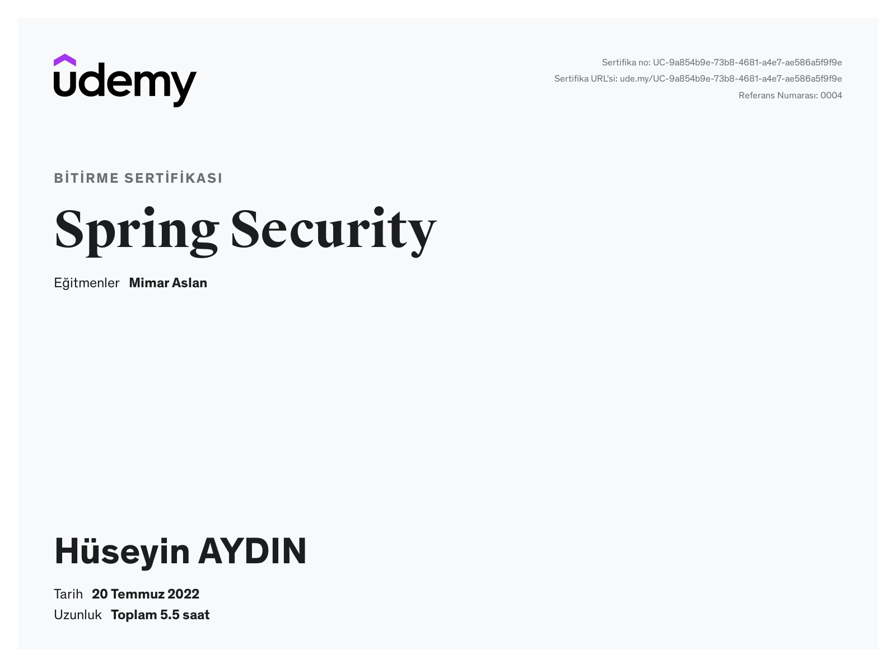

# spring-boot-security
#### Spring Security, güçlü ve son derece özelleştirilebilir bir kimlik doğrulama ve erişim kontrol çerçevesidir. Spring temelli uygulamaların güvenliğini sağlamak için de-facto standarttır.
#### Spring Security, Java uygulamalarına hem kimlik doğrulama hem de yetkilendirme sağlamaya odaklanan bir çerçevedir. Tüm Spring projelerinde olduğu gibi, Spring Security'nin gerçek gücü, özel gereksinimleri karşılamak için ne kadar kolay genişletilebileceğinde bulunur.
#### Özellikler
#### Hem Kimlik Doğrulama hem de Yetkilendirme için kapsamlı ve genişletilebilir destek verir.
#### Oturum sabitleme, tıklama hırsızlığı, siteler arası istek sahteciliği vb. saldırılara karşı koruma sağlar.

Mimar Aslan abi Udemy Spring Security kursu. Herkese tavsiye ederim.

Kursun linki: https://www.udemy.com/course/spring-boot-security/

### Eclipse ile projeyi içe aktarmanın yolu: File > Import > Maven > Existing Maven Project Browse > İlgili klasörün seçimi > Tamam!
